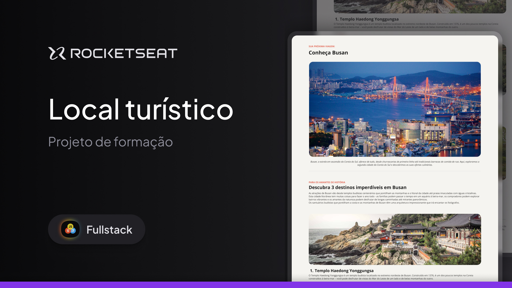

<h1 align="center"> Projeto Local Turistico </h1>

  

 

  

## 🚀 Tecnologias

Esse projeto foi desenvolvido com as seguintes tecnologias:

- HTML e CSS
- Git e Github
- Figma

## 💻 Projeto

Projeto de uma pagina de um local turisto, do curso de FullStack na RocketSeat, neste projeto foi utilizado algumas ferramentas aprendidas em aula, juntamente com alguma pesquisa em projetos anteriores da minha parte, uma simples pagina contendo descrições sobre algumas partes de Busan, contendo imagens e se é bom para saber a história, se é bom para familias e para o seu orçamento.

## :memo: Licença

Esse projeto está sob a licença MIT.

---

Feito com ♥ by Rocketseat :wave: [Participe da nossa comunidade!](https://discord.gg/rocketseat)
